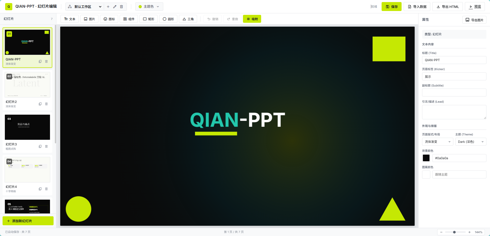
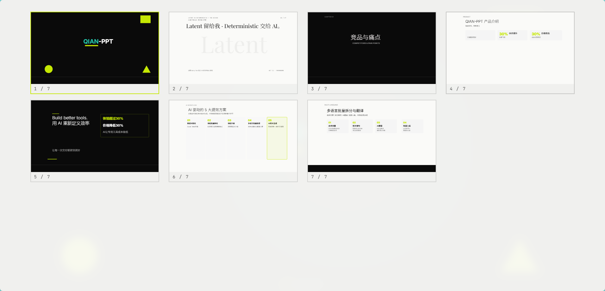
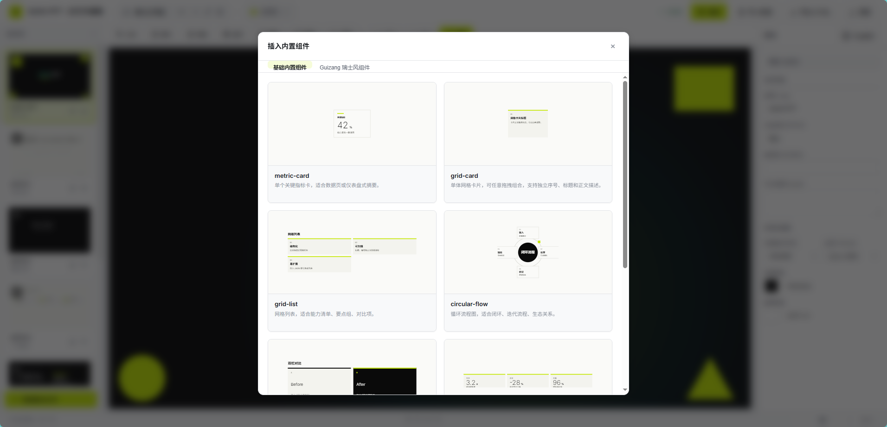

> 🏆 **Trae AI 创造力大赛参赛作品**

# Qian-PPT · 智能幻灯片编辑器

> 🌏 **English version: [README.en.md](./README.en.md)**

> Agent 生成 × 人工自由编辑 —— 新一代 PPT 工作流

基于 [guizang-ppt-skill](https://github.com/op7418/guizang-ppt-skill) 改造而来，在保留其精美杂志风视觉设计的基础上，增加了完整的可视化人工编辑能力和 CLI 工具链。

## 特点

- **Agent 友好**：支持利用各类 Agent 工具生成 PPT（Codex、Antigravity、Claude Code、Trae 等）
- **人工自由编辑**（重点升级）：提供完整的 Web 可视化编辑器，可随时介入调整
- **丰富的元素系统**：支持添加文本、形状、小组件、图标等各类元素
- **灵活的属性控制**：自由调整颜色、透明度、位置、大小等属性
- **内置 CLI 工具链**：一整套命令行工具，方便 Agent 精确编辑 PPT



*编辑界面：左侧幻灯片列表，中间画布编辑区，右侧属性面板*



*预览界面：全屏幻灯片播放效果*


*小组件窗口：内置多种预设组件，一键插入使用*

## 快速开始

### 方式一：让 Agent 帮你配置（推荐）

直接将下面这段话复制发给 Agent：

```
从 https://github.com/favoroo/qian-ppt 克隆这个项目，并且帮我配置好相关环境，启动 app.py。
```

支持 Claude Code、Codex、Trae、Cursor 等主流 Agent 工具。

### 方式二：手动配置

#### 环境要求

- Python 3.8+
- Flask 3.0+

#### 安装与运行

```bash
# 1. 克隆项目
git clone https://github.com/favoroo/qian-ppt.git
cd qian-ppt

# 2. 安装依赖
pip install -r requirements.txt

# 3. 启动服务
python app.py
```


服务启动后访问：

- **预览模式**：http://localhost:5001
- **编辑器**：http://localhost:5001/editor
- **指定工作区**：http://localhost:5001/editor?workspace=default

### 导出

在编辑器中点击「导出」按钮，会生成独立的 HTML 文件到当前工作区的 `data/workspaces/<workspace_id>/ppt/index.html`，可直接用浏览器打开或分享给他人，无需任何服务器。

## 项目结构

```
.
├── app.py                 # Flask 后端服务（API + 路由）
├── requirements.txt       # Python 依赖
├── templates/
│   ├── editor.html        # 编辑器页面
│   └── presentation.html  # 幻灯片展示页面
├── static/                # 静态资源（图标、JS库等）
├── data/
│   ├── slides.json        # 旧版默认数据文件（首次访问会归入 default 工作区）
│   └── workspaces/        # 多工作区数据、备份、导出和截图
│       └── default/
│           ├── slides.json
│           ├── backups/
│           ├── ppt/
│           └── slides_image/
├── ppt/                   # 旧版导出目录
└── .agents/skills/slide-editor/
    ├── slide_cli.py       # CLI 命令行工具
    └── components/        # 小组件模块
```

## 用户操作指南

### 截图还原：让 Agent 帮你复刻网页界面

**你可以直接将网页界面的截图发给 Agent，Agent 会自动分析页面结构并在幻灯片中高保真还原。**

使用方式：
1. 截取你想要还原的网页界面（如仪表盘、数据看板、产品介绍页等）
2. 将截图发给 Agent，并说明"帮我在02号幻灯片中还原这个界面"
3. Agent 会：
   - 分析截图中的布局结构、色彩、字体等设计元素
   - 使用 CLI 工具或 API 在幻灯片中重建对应元素
   - 调整位置、颜色、透明度等属性以匹配原图效果
4. 还原完成后，你可以在编辑器中进行微调

适合场景：产品演示、竞品分析、数据报告、UI 展示等需要将网页内容嵌入幻灯片的场景。

### 截图教学：教 Agent 如何修改幻灯片

**如果 Agent 修改的效果不理想，你可以给当前幻灯片截图，在图上标注你想要的效果，然后发给 Agent。**

使用方式：
1. 对需要修改的幻灯片进行截图
2. 在截图上标注或说明你想要的修改效果（如"把这个标题改大"、"按钮移到右边"等）
3. 将标注后的截图发给 Agent，说明修改意图
4. Agent 会理解你的意图并精确执行修改

这种方式比纯文字描述更直观，特别适合复杂的位置调整、排版优化等场景。

### 推荐工作流：先写需求文档，再生成 PPT

**最佳实践：用户只需写个草稿，Agent 会自动整理成适合幻灯片的格式。**

你不需要写得非常详细，简单描述你的想法即可，后续让Agent根据技能（slide-editor）生成幻灯片文档。

例如，你只需要写：

```markdown
# PPT 需求

## 主题
AI 如何改变软件开发流程，30分钟技术分享

## 要点
- 开头讲传统开发流程的痛点


- 中间展示 AI 引入后的变化和具体案例


- 最后总结

## 图片素材
你可以在文档中直接附上图片路径，Agent 整理好后会自动处理将图片插入到幻灯片中。

```
## 推荐流程
1. **先整理**：先让 Agent 根据根据你的草稿和 skill 文档（slide-editor），生成一份结构化的"幻灯片转换文档"，明确每页的布局（如标题、段落、图片、表格、图表等）等）、内容和视觉风格
2. **再生成**：再让Agent根据这份文档，调用技能（slide-editor）逐步生成完整的 PPT

## 操作示例
示例1：让Agent帮忙在01号幻灯片中添加一个然后的火焰


## Agent 使用指南

### 通过 CLI 工具编辑

项目内置了完整的 CLI 工具，Agent 可通过命令行精确操作幻灯片：

```bash
# 查看项目结构
python slide_cli.py tree

# 查看和切换工作区
python slide_cli.py workspace list
python slide_cli.py workspace create demo-talk --name "演示稿"

# 查看某张幻灯片的元素列表
python slide_cli.py --workspace default ls <slide_id>

# 定位某个元素的详细属性
python slide_cli.py locate <slide_id> <elem_id>

# 添加文本元素
python slide_cli.py --workspace default add-text <slide_id> "Hello World" --x 100 --y 200 --size 24

# 添加形状
python slide_cli.py add-shape <slide_id> rect --x 50 --y 50 --width 200 --height 100 --fill "#C5E803"

# 插入小组件
python slide_cli.py add-component <slide_id> metric-card --x 100 --y 100

# 更新元素属性
python slide_cli.py update <slide_id> <elem_id> --opacity 0.8 --color "#ff0000"

# 删除元素
python slide_cli.py delete <slide_id> <elem_id>

# 校验当前幻灯片结构
python slide_cli.py validate

# 导出为独立 HTML
python slide_cli.py --workspace default export
```

所有坐标使用 **960x540** 画布坐标系。

### 通过 API 编辑

Agent 也可以直接调用 REST API：

| 方法     | 路径                                | 说明          |
| ------ | --------------------------------- | ----------- |
| GET    | `/api/slides`                     | 获取全部幻灯片数据   |
| POST   | `/api/slides`                     | 保存全部幻灯片数据   |
| POST   | `/api/slides/create`              | 在指定位置插入新幻灯片 |
| PUT    | `/api/slides/<id>`                | 更新某张幻灯片     |
| DELETE | `/api/slides/<id>`                | 删除某张幻灯片     |
| GET    | `/api/slides/<id>/elements`       | 获取幻灯片的所有元素  |
| POST   | `/api/slides/<id>/elements`       | 添加元素        |
| PUT    | `/api/slides/<id>/elements/<id>`  | 更新元素属性      |
| DELETE | `/api/slides/<id>/elements/<id>`  | 删除元素        |
| POST   | `/api/slides/<id>/elements/batch` | 批量操作元素      |
| POST   | `/api/upload`                     | 上传图片        |
| GET    | `/api/components`                 | 获取可用小组件列表   |
| POST   | `/api/components/render`          | 渲染小组件 HTML  |
| GET    | `/api/export`                     | 导出为独立 HTML  |

所有数据 API 都支持 `?workspace=<workspace_id>`，未传时使用 `default`。

## 内置小组件

| 组件                  | 说明     |
| ------------------- | ------ |
| metric-card         | 关键指标卡片 |
| grid-card           | 网格卡片   |
| grid-list           | 网格列表   |
| circular-flow       | 闭环流程图  |
| compare-columns     | 双栏对比   |
| kpi-strip           | 指标横条   |
| screenshot-frame    | 截图美化框  |
| guizang-typography  | 杂志风排版  |
| guizang-callout     | 引用块    |
| guizang-stat-card   | 统计卡片   |
| guizang-stat-grid   | 统计网格   |
| guizang-pillar-card | 支柱卡片   |
| guizang-pillar      | 支柱组合   |
| guizang-rowline     | 行线列表   |
| guizang-figure      | 图片引用   |
| guizang-platform    | 平台数据卡片 |
| guizang-ghost       | 幽灵大字背景 |

## 与 guizang-ppt-skill 的对比

| 特性           | guizang-ppt-skill | Qian-PPT |
| ------------ |:-----------------:|:------:|
| 杂志风视觉设计      | ✅                 | ✅      |
| Agent 生成 PPT | ✅                 | ✅      |
| 可视化编辑器       | ❌                 | ✅      |
| CLI 工具链      | ❌                 | ✅      |
| REST API     | ❌                 | ✅      |
| 元素自由编辑       | ❌                 | ✅      |
| 图片上传管理       |                  | ✅      |
| 自动备份         | ❌                 | ✅      |
| 小组件系统        | ❌                 | ✅      |
